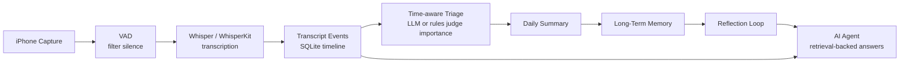

# Open Memory

**Open Memory is a local-first personal AI memory OS.**

它想做的事很简单，也很野：让 AI 不再只是一次性聊天窗口，而是逐渐拥有你的项目历史、生活线索、学习轨迹、偏好、目标和决策逻辑。它不会把一生硬塞进 prompt，而是把每天的碎片压缩成可查询、可修正、会成长的长期记忆。

In plain English: Open Memory turns phone capture, transcripts, summaries, and reflection into a private memory layer your AI can actually use.

## Why

今天的大模型很聪明，但它通常不认识你。

它不知道你上周为什么放弃一个方案，不知道你反复提到的项目什么时候开始，不知道哪些想法只是噪音，哪些想法其实应该被长期保存。Open Memory 要补上这一层：一个由你掌控、默认本地优先、可以持续生长的个人记忆系统。

The goal is not surveillance. The goal is a second mind with receipts: layered memory, user review, provenance, deletion, correction, and retrieval.

## Architecture



Open Memory uses layered memory instead of a giant context dump:

```text
capture -> transcript events -> time-aware triage -> daily summary
        -> long-term memory -> reflection -> retrieval QA
```

## What Works Now

- FastAPI backend.
- SQLite memory store.
- Timestamped text event ingestion.
- Time-aware category and importance scoring with LLM-ready ingest prompts.
- Automatic triage flow: keep, archive, or remember long term without blocking dialogs.
- Daily summaries.
- Long-term memory candidates.
- Self-reflection notes.
- Lexical retrieval QA with optional runtime LLM answers.
- Web dashboard.
- Docker / docker-compose.
- GitHub Actions CI.
- CLI: `open-memory setup/start/ask/models`.
- iOS capture scaffold for explicit Memory Sessions.

This MVP does not save raw audio by default. It assumes the iPhone app or a recorder worker sends text segments after VAD and transcription.

## Model Plan

```text
Whisper / WhisperKit       speech to text
Rules / small model        fallback category, tags, project detection, initial importance
Embedding model            semantic coordinates for similar-memory search
Qdrant / Chroma            vector database
Large model                ingest triage, summary, compression, reflection, reasoning, QA
```

When an event is created, Open Memory passes time context into the ingest assessment:

```text
assessed_at + occurred_at + source + metadata + text
```

If `OPEN_MEMORY_INGEST_LLM`, `OPEN_MEMORY_LLM`, or an event-level `llm` value is configured, the model returns category, tags, importance, reason, and whether the item should be kept, archived, or left for review. High-importance `kept` events are promoted into long-term memory automatically. If no model is configured, local rules do the same job as a fallback.

Importance is not a one-shot decision. Events start with `initial_importance`, then future versions can update `current_importance`, `importance_reason`, and `last_reassessed_at` as projects repeat, decisions change, or the user corrects the system.

## Quick Start

```bash
git clone https://github.com/qixuan-xu/open-memory.git
cd open-memory
python -m venv .venv
source .venv/bin/activate
pip install -e ".[dev]"
uvicorn backend.app.main:app --reload
```

Open:

- Dashboard: <http://127.0.0.1:8000/>
- API docs: <http://127.0.0.1:8000/docs>
- Health check: <http://127.0.0.1:8000/health>

Docker:

```bash
docker compose up --build
```

CLI:

```bash
open-memory setup --preset balanced
open-memory models list
open-memory models install whisper-small
open-memory start
```

## LLM Setup

Open Memory can run with no model, a local model, or a cloud model. The product still works without an LLM, but adding one unlocks two important behaviors:

- **Ask**: answer questions with retrieved evidence and citations.
- **Triage**: judge each new event's category, importance, tags, and whether it should become long-term memory.

```text
no LLM       retrieval-only, no network calls
Ollama       local models such as qwen2.5
LM Studio    local OpenAI-compatible chat server
OpenAI       cloud Responses API
```

### 1. Start Without A Model

This is the safest default. Nothing calls an LLM.

```bash
open-memory start
```

Then open <http://127.0.0.1:8000/>.

### 2. Use Ollama

Install or start Ollama, pull a model, then start Open Memory with that model:

```bash
ollama pull qwen2.5:7b
open-memory start --llm ollama:qwen2.5:7b
```

If `ollama serve` says `address already in use`, Ollama is already running. Continue with `ollama pull ...` and `open-memory start ...`.

Override the Ollama endpoint if needed:

```bash
OLLAMA_URL=http://localhost:11434/api/generate open-memory start --llm ollama:qwen2.5:7b
```

### 3. Use LM Studio

LM Studio works through its OpenAI-compatible local server:

1. Open LM Studio.
2. Load a model.
3. Start the Local Server.
4. Use the model id shown in LM Studio.

```bash
open-memory start --llm lmstudio:local-model
```

Override the endpoint if you changed LM Studio's port:

```bash
LM_STUDIO_URL=http://localhost:1234/v1/chat/completions open-memory start --llm lmstudio:local-model
```

### 4. Use OpenAI

Set an API key in your shell or `.env`, then choose an OpenAI model:

```bash
export OPENAI_API_KEY="replace-with-your-key"
open-memory start --llm openai:gpt-4.1
```

### 5. Pick A Separate Triage Model

By default, `--llm` powers both question answering and event importance triage. You can use a smaller or cheaper model just for ingest:

```bash
OPEN_MEMORY_INGEST_LLM=ollama:qwen2.5:7b open-memory start --llm openai:gpt-4.1
```

You can also pass a model for one event:

```bash
curl -X POST http://127.0.0.1:8000/events \
  -H "Content-Type: application/json" \
  -d '{
    "text": "明天必须继续做 iPhone VAD，优先解决后台录音状态显示。",
    "source": "manual",
    "llm": "ollama:qwen2.5:7b"
  }'
```

The LLM should return structured triage:

```json
{
  "category": "project",
  "importance": 0.86,
  "tags": ["iPhone", "VAD"],
  "importance_reason": "Time-sensitive project follow-up.",
  "review_status": "kept"
}
```

High-importance `kept` events are promoted into long-term memory automatically.

### 6. Ask From The CLI

You can ask without opening the dashboard:

```bash
open-memory ask "我之前对 ESP32 采集方案是什么看法？"
open-memory ask "我之前对 ESP32 采集方案是什么看法？" --llm ollama:qwen2.5:7b
open-memory ask "What changed recently?" --llm lmstudio:local-model
OPEN_MEMORY_LLM=openai:gpt-4.1 open-memory ask "What should I follow up tomorrow?"
```

Answer citations use short source labels:

- `[E1]` means Event 1, the first matching timeline event.
- `[M1]` means Memory 1, the first matching long-term memory.

These markers show which stored evidence the answer used.

## Try It

Seed a memory event:

```bash
curl -X POST http://127.0.0.1:8000/events \
  -H "Content-Type: application/json" \
  -d '{
    "text": "今天继续研究 ESP32 的语音采集方案，感觉 VAD 要先在手机端做，避免服务器存太多无意义音频。",
    "source": "manual"
  }'
```

Generate today summary and reflection:

```bash
python scripts/run_reflection.py
```

Ask your memory:

```bash
curl -X POST http://127.0.0.1:8000/query \
  -H "Content-Type: application/json" \
  -d '{"question": "我之前对 ESP32 采集方案是什么看法？"}'
```

Use a model for one API request:

```bash
curl -X POST http://127.0.0.1:8000/query \
  -H "Content-Type: application/json" \
  -d '{"question": "我之前对 ESP32 采集方案是什么看法？", "llm": "lmstudio:local-model"}'
```

## iOS Direction

The iOS app should be an explicit **Memory Session**, not hidden always-on listening.

- Start and pause recording clearly.
- Show visible recording state.
- Run VAD before transcription or upload.
- Keep raw audio local and temporary by default.
- Upload transcript events into the Memory Inbox.
- Let the user decide what becomes long-term memory.

Starter scaffold: [`ios/OpenMemory`](ios/OpenMemory)

## Local-First Rules

Model weights are not committed to Git. Git should contain code, config, download logic, and docs.

Do not commit:

- Whisper / Qwen / embedding model weights.
- Raw audio.
- SQLite memory databases.
- API keys.
- Cache files.

## Future Install Flow

```bash
brew tap qixuan-xu/open-memory
brew install open-memory
open-memory setup
open-memory models install whisper-small
open-memory models install bge-m3
open-memory start
```

Model presets:

```text
light      whisper-tiny + rules
balanced   whisper-small + bge-m3
local-ai   whisper-small + bge-m3 + qwen
cloud      whisper-small + bge-m3 + cloud GPT provider
```

## Roadmap

The original product intent and early architecture notes live in [`docs/conversation-seed.md`](docs/conversation-seed.md). The Chinese project memory and product context live in [`docs/project-context.md`](docs/project-context.md).

1. Polish the dashboard into a real AI memory cockpit.
2. Connect Whisper / faster-whisper transcription worker.
3. Add embeddings and Qdrant / Chroma semantic retrieval.
4. Add dynamic importance reassessment.
5. Add morning briefing and evening review.
6. Add memory deletion, correction, retention, and merge workflows.
7. Add privacy rules for what should never be remembered.
8. Build the iPhone capture app: recording, VAD, upload, pause switch.
9. Ship Homebrew tap and formal releases.

## Philosophy

Open Memory should slowly learn:

- what you care about
- what you are building
- how your goals change
- how you make decisions
- which patterns help or hurt you

不是为了记录一切，而是为了把真正有价值的东西留下来。

Not perfect memory. Useful memory.
