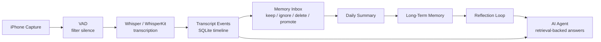

# Open Memory

**Open Memory is a local-first personal AI memory OS.**

它想做的事很简单，也很野：让 AI 不再只是一次性聊天窗口，而是逐渐拥有你的项目历史、生活线索、学习轨迹、偏好、目标和决策逻辑。它不会把一生硬塞进 prompt，而是把每天的碎片压缩成可查询、可修正、会成长的长期记忆。

In plain English: Open Memory turns phone capture, transcripts, summaries, and reflection into a private memory layer your AI can actually use.

## Why

今天的大模型很聪明，但它通常不认识你。

它不知道你上周为什么放弃一个方案，不知道你反复提到的项目什么时候开始，不知道哪些想法只是噪音，哪些想法其实应该被长期保存。Open Memory 要补上这一层：一个由你掌控、默认本地优先、可以持续生长的个人记忆系统。

The goal is not surveillance. The goal is a second mind with receipts: layered memory, user review, provenance, deletion, correction, and retrieval.

## Architecture



Open Memory uses layered memory instead of a giant context dump:

```text
capture -> transcript events -> memory inbox -> daily summary
        -> long-term memory -> reflection -> retrieval QA
```

## What Works Now

- FastAPI backend.
- SQLite memory store.
- Timestamped text event ingestion.
- Rule-based category and importance scoring.
- Memory Inbox review flow: keep, ignore, delete, or promote.
- Daily summaries.
- Long-term memory candidates.
- Self-reflection notes.
- Lexical retrieval QA, ready to swap for vector search.
- Web dashboard.
- Docker / docker-compose.
- GitHub Actions CI.
- CLI skeleton: `open-memory setup/start/models`.
- iOS capture scaffold for explicit Memory Sessions.

This MVP does not save raw audio by default. It assumes the iPhone app or a recorder worker sends text segments after VAD and transcription.

## Model Plan

```text
Whisper / WhisperKit       speech to text
Rules / small model        category, tags, project detection, initial importance
Embedding model            semantic coordinates for similar-memory search
Qdrant / Chroma            vector database
Large model                summary, compression, reflection, reasoning, QA
```

Importance is not a one-shot decision. Events start with `initial_importance`, then future versions can update `current_importance`, `importance_reason`, and `last_reassessed_at` as projects repeat, decisions change, or the user corrects the system.

## Quick Start

```bash
git clone https://github.com/qixuan-xu/open-memory.git
cd open-memory
python -m venv .venv
source .venv/bin/activate
pip install -e ".[dev]"
uvicorn backend.app.main:app --reload
```

Open:

- Dashboard: <http://127.0.0.1:8000/>
- API docs: <http://127.0.0.1:8000/docs>
- Health check: <http://127.0.0.1:8000/health>

Docker:

```bash
docker compose up --build
```

CLI:

```bash
open-memory setup --preset balanced
open-memory models list
open-memory models install whisper-small
open-memory start
```

## Try It

Seed a memory event:

```bash
curl -X POST http://127.0.0.1:8000/events \
  -H "Content-Type: application/json" \
  -d '{
    "text": "今天继续研究 ESP32 的语音采集方案，感觉 VAD 要先在手机端做，避免服务器存太多无意义音频。",
    "source": "manual"
  }'
```

Generate today summary and reflection:

```bash
python scripts/run_reflection.py
```

Ask your memory:

```bash
curl -X POST http://127.0.0.1:8000/query \
  -H "Content-Type: application/json" \
  -d '{"question": "我之前对 ESP32 采集方案是什么看法？"}'
```

## iOS Direction

The iOS app should be an explicit **Memory Session**, not hidden always-on listening.

- Start and pause recording clearly.
- Show visible recording state.
- Run VAD before transcription or upload.
- Keep raw audio local and temporary by default.
- Upload transcript events into the Memory Inbox.
- Let the user decide what becomes long-term memory.

Starter scaffold: [`ios/OpenMemory`](ios/OpenMemory)

## Local-First Rules

Model weights are not committed to Git. Git should contain code, config, download logic, and docs.

Do not commit:

- Whisper / Qwen / embedding model weights.
- Raw audio.
- SQLite memory databases.
- API keys.
- Cache files.

## Future Install Flow

```bash
brew tap qixuan-xu/open-memory
brew install open-memory
open-memory setup
open-memory models install whisper-small
open-memory models install bge-m3
open-memory start
```

Model presets:

```text
light      whisper-tiny + rules
balanced   whisper-small + bge-m3
local-ai   whisper-small + bge-m3 + qwen
cloud      whisper-small + bge-m3 + cloud GPT provider
```

## Roadmap

The original product intent and early architecture notes live in [`docs/conversation-seed.md`](docs/conversation-seed.md). The Chinese project memory and product context live in [`docs/project-context.md`](docs/project-context.md).

1. Polish the dashboard into a real AI memory cockpit.
2. Connect Whisper / faster-whisper transcription worker.
3. Add embeddings and Qdrant / Chroma semantic retrieval.
4. Add dynamic importance reassessment.
5. Add morning briefing and evening review.
6. Add memory deletion, correction, retention, and merge workflows.
7. Add privacy rules for what should never be remembered.
8. Build the iPhone capture app: recording, VAD, upload, pause switch.
9. Ship Homebrew tap and formal releases.

## Philosophy

Open Memory should slowly learn:

- what you care about
- what you are building
- how your goals change
- how you make decisions
- which patterns help or hurt you

不是为了记录一切，而是为了把真正有价值的东西留下来。

Not perfect memory. Useful memory.
